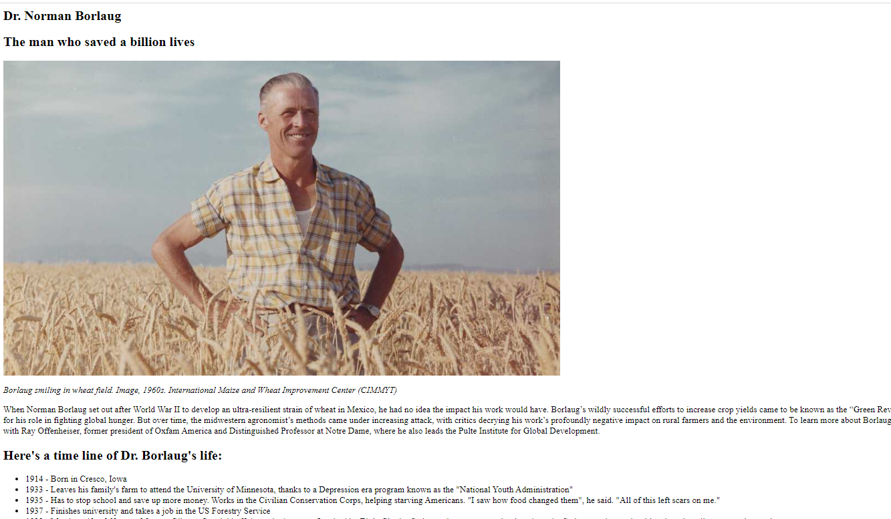

# Project Name

> My project name is "Tribute page"

This is the re-make of one of the coding trails

## Built With

- HTML, CSS
- Linterns
- Git used as remote repo

## Authors

👤 **Author1**

- GitHub: [@herokudev](https://github.com/herokudev)
- LinkedIn: [LinkedIn](https://linkedin.com/in/armando-orellana-a0b50b34)

## 🤝 Contributing

Contributions, issues, and feature requests are welcome!

## Show your support

Give a ⭐️ if you like this project!

## Acknowledgments

- Hat tip to anyone whose code was used
- Inspiration
- etc

## 📝 License

This project is [MIT](./MIT.md) licensed.
